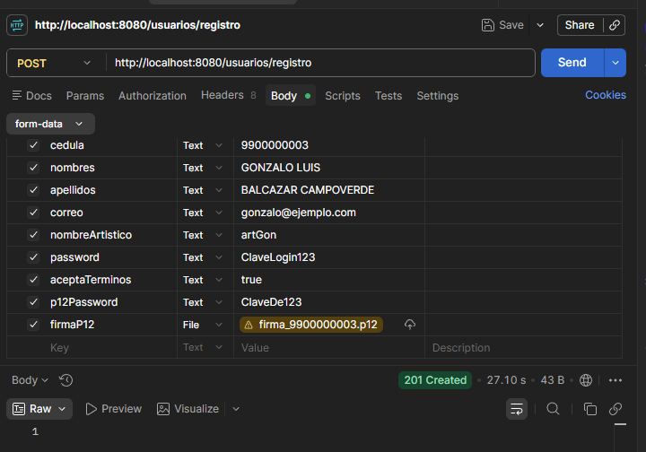
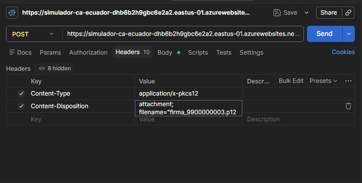

# Módulo de Identidad 
## 1. Misión del Módulo

Establecer la **"Raíz de Confianza" (Root of Trust)**. En informática forense, ninguna evidencia (firma o certificado) tiene validez si no se puede vincular de forma irrefutable con una identidad civil verificada. Este módulo asegura que solo autores reales y validados por el Estado puedan entrar al sistema.

## 2. Arquitectura de Software

* **Patrón:** Arquitectura Hexagonal (Puertos y Adaptadores).
* **Estilo:** Microservicios Cloud-Native.
* **Framework:** Quarkus 3.35+ (Optimizado para alto rendimiento y bajo consumo).
* **Principios:** Cumplimiento de los **12-Factor App** 
  * Configuración 
  * Backing Service
## 3. El Flujo de Registro Forense (Los 4 Pilares)

1. **Validación Externa (Integridad):** Consumo de una API externa (Python/Azure) que emula el Registro Civil. El sistema no "cree" en lo que el usuario escribe, lo "verifica".
2. **Seguridad Criptográfica (Confidencialidad):** Uso de BCrypt con factor de costo 12. Las contraseñas no se guardan; se genera un hash irreversible que protege la identidad incluso ante una filtración de la base de datos.
3. **Persistencia Robusta:** Uso de PostgreSQL con identidades basadas en UUID para evitar ataques de enumeración de usuarios.
4. **Optimización Reactiva:** Implementación de la estrategia `@Blocking` para manejar operaciones de red y base de datos sin congelar el núcleo del sistema (Event Loop).

## 4. Componentes Clave 

| Componente | Tecnología | Función Forense |
| :--- | :--- | :--- |
| **IdentityClient** | MicroProfile Rest Client | Interoperabilidad con el microservicio legal de identidad. |
| **AuthService** | CDI Bean (Application Layer) | Orquestador de la lógica de negocio y seguridad. |
| **UserEntity** | Hibernate Panache | Mapeo de la "Tabla Rosa" (Usuarios) con integridad de datos. |
| **BCrypt** | JBCrypt | Garantiza el No-Repudio del acceso mediante hashing fuerte. |

---
# Microservicio de Identidad
## 1. Estructura: Arquitectura Hexagonal
Esta organización garantiza la independencia de la lógica de negocio frente a la infraestructura (Base de Datos y APIs externas).
```
module-a-identity/
├── src/main/java/com/tesis/identity/
│   ├── application/
│   │   └── AuthService.java                         <-- Lógica de Registro y Login 
│   ├── domain/
│   │   └── models/
│   │       └── User.java                            <-- Modelo de dominio
│   └── infrastructure/
│       ├── client/
│       │   └── IdentityClient.java                  <-- Cliente para la API simulación registro civil
│       │   └── SignatureClient.java                  <-- Cliente para la API simulación ca
│       ├── persistence/
│       │   └── UserEntity.java                      <-- Mapeo de Tabla "usuarios" 
│       └── rest/
│           └── UserResource.java                    <-- Endpoint expuesto (API Controller)
│           └── ConstraintViolationMapper.java       <-- Errores de duplicidad
├── src/main/resources/
│   └── application.properties                        <-- Configuración 
└── build.gradle.kts                                  <-- Gestión de dependencias 
```

## 2. Pruebas de Endpoints Login y Registro 
### 2.1. Resgistro
Este es el verbo que el Frontend (o Postman) consume para crear un nuevo autor en el sistema.

* **Método:** POST
* **URL:** `http://localhost:8080/usuarios/registro`
  
**Nota de Seguridad:** El campo `passwordHash` en este nivel lleva la contraseña en texto plano. El sistema la procesa con **BCrypt (Costo 12)** antes de que toque la base de datos.

### 2.2. Login
Este es el verbo que el Frontend (o Postman) consume para inicio de sesión del usuario en el sistema.

* **Método:** POST
* **URL:** `http://localhost:8080/usuarios/login`
* **Content-Type:** `application/json`

**Cuerpo de la Petición:**
```json
{
  "correo": "mercedes@art.com",
  "password": "Admin123!"
}
```

### Pruebas de errores
1. Control de mensajes amigables al usuario en caso de ducpilicidad de atributos unicos como `cedula` y `email`.
   * **Resultado esperado:** `409 Conflict`
   * **Mensaje:** `"error": "Error de integridad: El correo o la cédula ya se encuentran registrados."`
2. No aceptacion de terminos y condiciones que requiere el sistema para validar su registro de forma éxitosa
   * **Resultado esperado:** `"details": "Error id 24d29baa-71c3-4a5e-86ef-e18feed18030-1, java.lang.RuntimeException: Debe aceptar los terminos y condiciones para registrarse."` 

## 3. Protocolo de Validación 

Este es el recurso externo que asegura la integridad de la identidad mediante la conexión con el simulador del Registro Civil.

* **Método:** POST
* **URL:** `https://api-simulacion-registro-civil-evbgdua8hvgpfkht.eastus-01.azurewebsites.net/api/validar-persona`
* **Content-Type:** `application/json`

**Cuerpo de la Petición (JSON-B):**
```json
{
  "cedula": "9900000001",
  "name": "ANA",
  "surname": "PEREZ"
}
```

**Respuesta del Recurso:**

* **Éxito:** `1` (String) → El proceso de registro continúa.
* **Fallo:** `0` (String) → Se lanza una excepción y el registro se cancela.
---
# Endpoint protocolo de firmas digitales
* generar firmas
  https://simulador-ca-ecuador-dhb6b2h9gbc6e2a2.eastus-01.azurewebsites.net/api/ca_emulada
debe ir en body
```json
{
  "cedula": "9900000003",
  "name": "GONZALO LUIS",
  "surname": "BALCAZAR CAMPOVERDE",
  "password": "ClaveDe123"
}
```
se debe usar tambien el hearder para descargar la firma.p12 en donde dice SEND y la flecha ▼ esta send y download con eso se descarga el archivo



igual retorna 0 o 1 en caso de exito o fallo
* validar firma
  https://simulador-ca-ecuador-dhb6b2h9gbc6e2a2.eastus-01.azurewebsites.net/api/validar_firma_externa
```json
{
  "cedula": "9900000003",
  "p12Base64": "XXXXXXXXXXXXXXXX",
  "password": "XXXXXXXX"
}
```
* firmar obra
  https://simulador-ca-ecuador-dhb6b2h9gbc6e2a2.eastus-01.azurewebsites.net/api/firmar_obra

```json
{
  "p12Base64": "vía base de datos",
  "password": "la que el usuario escribe en el cuadrito de texto",
  "hashObra": "el hash SHA-512 que ella generó de la imagen"
}
```


---

### ¿Cómo funcionaría este nuevo proceso (Estilo SRI)?

Cuando el usuario ya está logueado y quiere certificar una obra, el flujo sería este:

1.  **Formulario en Frontend:**
    *   El usuario sube su imagen (PNG/JPG).
    *   Escribe el Título, Software, etc. 
    *   **Paso Clave:** El sistema le pide: *"Ingresa tu clave de firma electrónica"*.

2.  **Lógica en el Backend (Quarkus):**
    *   Tu código busca en la base de datos al usuario y recupera su `firma_p12` (el Base64).
    *   Llamas a un **NUEVO endpoint** en tu Azure Function de Python llamado `/firmar_obra`.
    *   **Le envías:** El Base64 guardado + la clave que el usuario acaba de escribir + los metadatos de la obra.

3.  **Lógica en Python (Azure):**
    *   Recibe el archivo y la clave.
    *   **Desencripta** el `.p12` en memoria.
    *   Usa la **Llave Privada** para firmar el hash de la imagen.
    *   Devuelve la firma digital.

---


